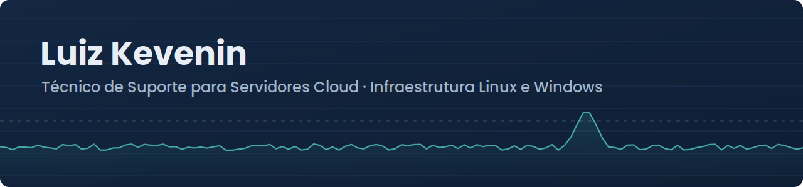

  

  
  

## Sobre

Trabalho com infraestrutura desde 2023 na **Host One**, provedora de servidores cloud e dedicados. Entrei como estagiário e fui efetivado como **Técnico de Suporte para Servidores Cloud** em 2025. Curso **Engenharia de Sistemas na UFMG**.

Minha base é operação: manter servidores de clientes funcionando, entender por que um serviço caiu e colocá-lo de volta no ar, inclusive em plantões em que respondo sozinho pelo atendimento. A partir dessa base, uso Bash e Python para automatizar tarefas repetitivas e estou estudando DevOps e Cloud.

## O que faço no dia a dia

| Área | Na prática |
|---|---|
| **Servidores** | Administração de Linux (Ubuntu, AlmaLinux, CentOS) e Windows Server (IIS) em ambientes cloud e dedicados |
| **Virtualização** | Suporte a VMs de clientes em Proxmox VE e Apache CloudStack: redimensionamento de discos, ajustes de rede e análise de armazenamento |
| **Incidentes** | Troubleshooting de disponibilidade, desempenho e segurança, incluindo análise e mitigação de ataques DDoS |
| **Serviços** | Configuração e manutenção de Nginx, Apache, BIND (DNS), Exim, MySQL e MariaDB |
| **Monitoramento e backup** | Zabbix e Nagios, análise de logs e rotinas de backup e recuperação com Bareos |
| **Automação** | Scripts em Bash e Python para tarefas operacionais e uso de Ansible |

## Tecnologias

**Sistemas operacionais** 
     

**Virtualização e cloud** 
  

**Serviços e bancos de dados** 
     

**Monitoramento e backup** 
  

**Automação, containers e versionamento** 
    

## Projetos

<table>
  <tr>
    <td width="50%" valign="top">
      <h3><a href="https://github.com/luiz-kevenin/disk-alert">Monitoramento de disco</a></h3>
      
Monitoramento de uso de disco em Bash com alertas via webhook do Discord. Dois modos de operação (relatório programado e detecção de crescimento), controle de estado entre execuções e lock contra execução concorrente.

      
<code>Bash</code> <code>Linux</code> <code>cron</code> <code>Discord</code>

    </td>
    <td width="50%" valign="top">
      <h3><a href="https://github.com/luiz-kevenin/nexfinance">NexFinance</a></h3>
      
SaaS de gestão de devedores e cobrança para pequenos negócios, em produção. Projeto independente, do desenvolvimento ao deploy em containers Docker numa instância AWS EC2.

      
<code>Next.js</code> <code>PostgreSQL</code> <code>Docker</code> <code>AWS EC2</code>

    </td>
  </tr>
</table>

## Direção

Minha experiência é em operação de infraestrutura, e o próximo passo é levar essa base para automação, containers e observabilidade. Os próximos projetos publicados aqui seguem essa linha.
